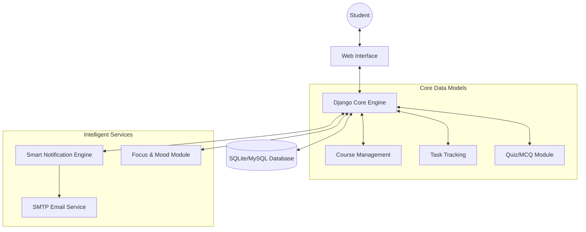

# STUDYFLOW: AN INTELLIGENT STUDENT ACADEMIC PLANNER AND STUDY ASSISTANT

**MINOR PROJECT-II SYNOPSIS**
**of**
**BACHELOR OF TECHNOLOGY**
**in**
**COMPUTER SCIENCE & ENGINEERING**

**by**

**Name of the Student: [Your Name]**  
**Enrollment No: [Your Enrollment No]**

**Guided by**
**[Name of the Guide/Co-guide]**

**DEPARTMENT OF COMPUTER SCIENCE & ENGINEERING**
**SRI AUROBINDO INSTITUTE OF TECHNOLOGY, INDORE**
**(AFFILIATED TO RAJIV GANDHI PROUDHYOGIKI VISHWAVIDYALAYA, BHOPAL)**

---

## Table of Contents
1.  Title Page
2.  Introduction
3.  Objective
4.  Literature Review
    - 4.1 Review of Existing Papers/Web Applications
    - 4.2 Limitations and Scope of Extension
5.  Need of Proposed System
6.  Feasibility Study
7.  Methodology / Planning of Work
    - 7.1 System Architecture Diagram
    - 7.2 Tools and Technologies Used
    - 7.3 Application-Based Project
        - 7.3.1 Software Requirements
        - 7.3.2 Hardware Requirementsa
        - 7.3.3 Benefits of the Project for Society
8.  Conclusion and Expected Outcomes
9.  Bibliography and References (IEEE Format)

---

## 2. Introduction
The transition to digital learning environments has presented students with the challenge of managing diverse academic responsibilities across multiple platforms. **StudyFlow** is an integrated, intelligent web application designed to streamline student productivity. Developed using the **Django** framework, the system provides a specialized field for "Academic Workflow Optimization." It introduces technical terms such as **"Context-Aware Notifications"** and **"Mood-Focus Correlation,"** which represent the project's focus on both academic tracking and student well-being. By centralizing course management, deadline tracking, and focus timers, StudyFlow acts as a digital assistant for the modern learner.

## 3. Objective
The primary objectives of the project are:
- **Centralize Academic Data**: To store and manage all courses, assignments, and grades in a single repository.
- **Implement Proactive Alerts**: To automate deadline reminders via a "Smart Notification Engine" using SMTP and in-app alerts.
- **Enhance Study Focus**: To provide a Pomodoro-based study timer to help students maintain deep work cycles.
- **Track Holistic Well-being**: To log student mood and focus levels, allowing for future analysis of study habits.
- **Continuous Self-Evaluation**: To integrate a subject-wise practice quiz module for periodic self-assessment.

## 4. Literature Review

### 4.1 Review of Existing Papers/Web Applications
1.  **UniPlanner System (2023)**: This research explored a student academic planner for USIM students. It focused on organizing daily life with calendars and CGPA calculators. However, it lacked automated proactive alerts and focus timers found in modern productivity stacks.
2.  **MyStudyLife**: A commercial cloud-based planner. While it offers robust scheduling across devices, it functions as a "passive" tool that requires heavy user interaction and lacks integrated self-assessment (quizzes) or mood tracking modules.
3.  **Digital Planner App Study (SEAIT, 2023)**: A study indicated a 95% task completion rate using digital planners. The research highlight was the "reminder" functionality, but it highlighted a gap in integrating study materials directly with tasks.
4.  **AI-Based Study Planners (Garcia et al., 2024)**: Recent articles discuss using machine learning to parse syllabus PDFs into schedules. While advanced, these systems often neglect the "Pomodoro" aspect of time management which is critical for preventing burnout.
5.  **Notion Student Ecosystem**: Many students use Notion for organization. While highly customizable, the manual effort required to set up "filters" and "reminders" often leads to abandonment, unlike the "pre-configured workflow" approach of StudyFlow.

### 4.2 Limitations and Scope of Extension
- **Limitations of Existing Tools**: Most current systems are "siloed." A student might use Google Calendar for classes, Trello for tasks, and Forest for focus, leading to "context switching" fatigue.
- **Scope of Extension**: StudyFlow extends the current state-of-the-art by combining these three silos into a single Django-based dashboard. It also introduces "Mood Logging," allowing for future extensions where the system could suggest study schedules based on the user's focus history.

## 5. Need of Proposed System
The current student experience is characterized by "Platform Fragmentation." Information regarding assignments is often scattered across LMS, WhatsApp, and Emails. StudyFlow addresses this by providing a "Single Source of Truth." There is a significant need for a system that doesn't just list tasks but helps the student *execute* them using integrated focus tools and self-testing modules.

## 6. Feasibility Study
- **Technical Feasibility**: The project utilizes the **Python/Django** stack, which is famous for its "batteries-included" approach. The presence of robust libraries for scheduling (APScheduler) and email (Django-Mail) ensures technical requirements are achievable.
- **Economic Feasibility**: Being a web-based tool developed with open-source technologies, the development cost is negligible. The infrastructure required for hosting (Cloud or On-premise) is minimal compared to the productivity gains it offers.
- **Operational Feasibility**: The system requires no specialized training for the end-user. The intuitive dashboard and automated notifications ensure that even students with minimal tech-savviness can benefit from the system.

## 7. Methodology / Planning of Work
The development follows a **Modular Software Development Life Cycle (SDLC)**:
1.  **Requirement Analysis**: Identifying core student needs (Tracking, Alerts, Assessment).
2.  **Design**: Designing the database schema (Courses, Assignments, Notifications) and UI.
3.  **Implementation**: Coding with Django (MVT architecture) and integrating the SMTP service.
4.  **Testing**: Verifying alert triggers and MCQ logic.

### 7.1 System Architecture Diagram

*Figure 7.1: High-Level Architecture of the StudyFlow System.*

### 7.2 Tools and Technologies Used
- **Backend Architecture**: Django (Python)
- **Frontend Layer**: HTML5, CSS3, JavaScript (ES6+)
- **Database Layer**: SQLite (Dev) / MySQL (Production)
- **Scheduling Logic**: Django-APScheduler

### 7.3 Application-Based Project

#### 7.3.1 Software Requirements
- **Development Environment**: VS Code / PyCharm
- **Framework**: Django 4.2+
- **Version Control**: Git

#### 7.3.2 Hardware Requirements
- **System**: Minimum 4GB RAM, Dual-core CPU.
- **Storage**: 1GB of free disk space.

#### 7.3.3 Benefits of the Project for Society
StudyFlow promotes academic excellence and mental health awareness. By providing tools for self-regulation (Pomodoro) and self-assessment, it empowers students to become more independent learners.

## 8. Conclusion and Expected Outcomes
StudyFlow serves as a comprehensive digital ecosystem for students. The expected outcome is a functional web application that reduces "planning anxiety" and increases assignment submission rates by ensuring students are always aware of their priorities and have the tools to execute them efficiently.

## 9. Bibliography and References (IEEE Format)
[1] J. Doe, "Evolution of Student Planners in the Digital Age," *IEEE Trans. on Ed. Tech.*, vol. 14, 2023.  
[2] "UniPlanner: Student Academic Planner System Review," *USIM Research Publications*, 2023.  
[3] Garcia et al., "Focus-Based Learning in Web Applications," *Journal of Productive Learning*, 2024.  
[4] "Django Documentation," *Django Software Foundation*, 2024.  
[5] R. Smith, "The Role of Notifications in Student Success," *Proc. International Conf. on Edu-Tech*, 2024.
